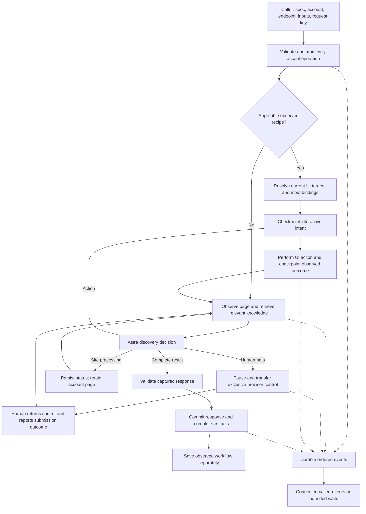

# Execution and recovery

The execution service is the only browser owner. CLI processes, stdio MCP bridges, Streamable HTTP MCP clients, and HTTP clients share its SQLite store and queue. A client connection never creates another executor.

## Persistence

`state.sqlite` uses WAL, full synchronous commits, and atomic operation/event updates. Artifact identities cover their content digest, filename, and media type; bytes are written and flushed before their metadata is committed, and checked by digest when read. Browser profiles, model processes, and sandbox IDs do not define operation identity.

The service directory is private to its owner. It contains the database, artifacts, service token, and local account-specific browser profiles. Mount a persistent volume outside E2B for a server deployment. Treat that volume and its backups as account data; this prototype does not implement multi-tenant encryption/key management or automatic retention/deletion.

An OS-owned SQLite exclusive lock rejects simultaneous service owners and releases on process death without deleting stale lock files. Do not run multiple replicas against this store. Startup retains queued requests and marks interrupted active work for inspection. Operations with prior submission evidence, pending interactive actions, or interrupted claimed human control enter reconciliation, without replaying their writes. Cumulative discovery time survives restart. The initial 10-minute allowance excludes queued time, human assistance, and scheduled job waits.

## Progress contract

Every accepted request has a durable `operation_id`; every event has a monotonically increasing sequence within that operation. State updates and events commit together. `wait_operation` returns the operation snapshot, an event batch, a cursor, and `has_more`. Reconnect with the same operation ID and the last consumed cursor. Delivery can repeat events; consumers deduplicate by sequence. A caller must never repeat `execute` with a new request key just to reconnect.

Heartbeats indicate that the service is alive. They are distinct from observed job progress. Human requests, adapter failures, captured target errors, and final results have explicit events. A completed target error response can be a successfully captured API response; callers must inspect `api_response.status`.

MCP callers use structured execute/get/wait results. HTTP SSE and CLI NDJSON provide live consumption. Host-specific display of MCP notifications is not assumed to feed the calling model. The implementation includes standard stateless Streamable HTTP MCP and a stdio bridge; it does not use the optional MCP Tasks extension.

## Learning and coverage

The model proposes typed browser actions. The application binds request inputs, applies the submission guard, performs the action, and captures results. There is no model-accessible JavaScript, shell, fetch, or private target-API tool.

Site knowledge stores structural control counts by origin with timestamps; it excludes observed titles, accessible names, paths, and signed URLs. Account-scoped observed recipes supply navigation and form knowledge across endpoints. Fresh observations supply current business data. Candidate steps and extraction evidence remain on the operation. A schema-valid result can promote a recipe, independently from committing the result. A promotion failure must not repeat the completed business operation.

Recipe coverage is derived from observed bindings rather than accepted from a model's assertion. Free-text values used exclusively in a fill binding can vary. Bound artifact IDs can vary within the same media type. Select values, check states, unrelated parameters, object shape, and values baked into locators/URLs remain fixed. All later calls still validate against the API input schema, resolve current UI elements, capture fresh results, and validate output. Coverage describes a guarded workflow; it does not prove equivalence with every vendor API behavior.

## Submission and human ownership

The initial runner supports one business-submission boundary per operation and treats every generic button click as submission. It checkpoints all interactive actions before dispatch, even when the planner calls them preparation. If the action fails, another write is prohibited until the situation is resolved. Read-only observation, extraction, links/tabs, and downloads support reconciliation. This is a conservative guard, not a target-side exactly-once transaction: UI semantics can be ambiguous, and websites may attach effects to apparently harmless controls.

An unfinished operation retains its account page through job waits and attention pauses. Async recipes replay only the preparation/submission prefix; the planner must inspect live job state before accepting a result. Human handoffs retain the live browser and stop the shared queue. The authenticated control page claims ownership with an exclusive secret capability; access and return require that token. Return control records whether the human submitted the operation, did not submit, or is unsure. The reported outcome commits before browser release. Submitted/unknown outcomes enable read-only reconciliation. Release failures keep human ownership and permit only an identical token-authorized return retry. A caller's resume command cannot seize a human-owned browser. E2B return control stops the interactive stream before automated work resumes.

Cancellation before submission stops local work. After submission, stopping local monitoring does not claim to cancel the remote job. A disconnect is never cancellation.

## Boundaries still requiring pilot validation

- Real Powder and Reducto UI/API field and behavior parity, including complete JSON exports.
- Workflows requiring multiple business submissions or hidden autosaves.
- E2B template/CDP/desktop-stream interoperability and live human takeover.
- Expired login and account/tenant verification on the real sites.
- Camofox comparison; the implemented baseline uses Playwright.
- Browser control inside the chosen calling-agent host; protocol tests use official SDK clients.

These are acceptance gates, not claims that follow from passing the local fixture tests.
